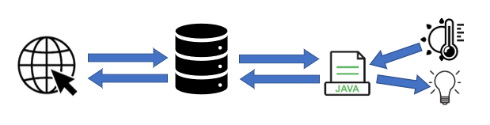
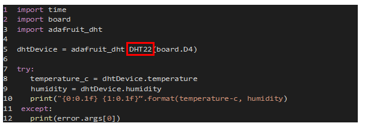

**Github Description Project Fungarium/Terrarium**

Documentation of a study thesis of the DHBW Stuttgart by Sven Schelling and Robin Michael Lägler in May 2021.

**Abstract:**

Automated control of the temperature, humidity and light of a fungarium/terrarium, for mushroom breeding or keeping animals.

Based on a Raspberry Pi running Apache web server and MySQL database, which can control different actuators via relays connected to a Java control program.

The Java application is controlled via the GPIO pins of the Raspberry Pi.

Access to the control page is secured via a &quot;.htaccess&quot; and &quot;.htpasswd&quot; file.

In addition, the server-client connection is secured by integrating an SSL certificate by ACME Certbot.

**Architecture of the project:**

**Required components:**

- Raspberry Pi (preferably Raspberry Pi 4) as a central computer running the Apache web server, the MySQL database, and the Java application.
- Terrarium/aquarium or similar as container
- DHT22 sensor for temperature and humidity measurement
- Relays for controlling the components.

**Additional components:**

- light
- Fan (fan high and low speed)
- Heating
- cooling
- Terrarium Fogger

**Configuration of the components:**

The components are selected via the control page using checkboxes.

The data wire of the DHT22 sensor must be connected to the pin GPIO4 of the Raspberry Pi (see code example). If a DHT11 is used, the &quot;mydht.py&quot; file must change the value &quot;DHT22&quot; to &quot;DHT11&quot;. The power supply can be selected via the control side.

**Software description:**

**Operating modes** :

- Automatic: The sensor data is compared every 2min with the setting parameters in the Java application controlling various components (e.g.: measured humidity less than set minimum humidity àventilation starts)
- Manual: manual control of existing components in the project with maximum time delay of 30s.

The **controlling page** comprises a total of four pages:

- menu
- temperature
- humidity
- protocol

**Menu** : Adjustment of various setting parameters(minimum humidity, light start, light end, ventilation interval, ventilation duration, humidification period, minimum temperature, maximum temperature), change from manual to automatic operation mode, adjustment of the presets (pin assignment of components, existing components in the project)

**Temperature** : graphical as well as a tabular representation of the temperature of the measured DHT sensor data.

**Humidity** : graphical as well as a tabular representation of the humidity of the measured DHT sensor data.

**Protocol** : Notification of possible error messages (e.g. incorrect measurement) or state changes of the hardware components.

The frontend is currently only available in German.

The following figure shows the **Temperature** page:

The features and use cases of the software, as well as the complete documentation of the project are included in the file &quot;_ **Documentation\_Fungarium.pdf** _&quot;.

**Preinstallation:**

Before you can run the bash script, there must be a domain to use for the project. This domain must be connected to the home network router using &quot;Dynamic DNS&quot;. In addition, a port forwarding from the router to the raspberry Pi must be made in the router settings, so that the webserver is also accessible outside the home network.

**Installation:**

To facilitate the installation and configuration of the project (installation and setup of the Apache server, the MySQL database, and the Java control program), the project is encased in a bash script.

The bash consists of two parts. This structure is chosen because a system restart is required while the script is running.

It is important to run the bash script after reboot with the same command (as the first start) so that the remaining packages can be downloaded and installed!

Before running the bash script, the Github repository must be downloaded along with the Java control program, by executing the following command in the terminal:

_sudo git clone https://github.com/svenSchelling/Fungarium.git/home/pi/Fungarium_

To run the script, you must first navigate to the created folder in the Raspberry Pi main directory where the bash script resides:

_cd /home/pi/Fungarium_

In most cases, the start is not possible directly due to the authorization of the respective user. The authorization can be changed via the following command in the terminal:

_chmod 774 start\_fungarium.sh_

The boot call of the script is then executed via the following command in the terminal on the Raspberry Pi:

_./install\_fungarium_

After restarting within the bash script, the same command must be entered to run the second part of the script.

**License:**

MIT License

**Support for updates and other projects:**

PayPal: [https://paypal.me/pools/c/8zo9umo6aW](https://paypal.me/pools/c/8zo9umo6aW)

Thank you very much!

**Contact:**

If you have any questions, please email: [sven@fam-schelling.de](mailto:sven@fam-schelling.de), [robin.laegler@googlemail.com](mailto:robin.laegler@googlemail.com)
